# pythonic

```mermaid
graph TD
;
    python[Python];
    python --> data_types_and_structures[Data types and structures];
    python --> duck_typing[Duck typing];
    python --> modules[Modules];
%%%%    
    pythonic[Pythonic];
    pythonic --> decorators[Decorators];
    pythonic --> descriptors[Descriptors];
    pythonic --> data_classes[Data classes];
    pythonic --> iterators_and_generators[Iterators and Generators];
    pythonic --> context_manager[Context manager];
    pythonic --> first_class_objects[First class objects];
    pythonic --> list_comprehension[List comprehension];
    pythonic --> dunder_methods[Dunder/magic methods];
    pythonic --> metaclass[Metaclass];
    pythonic --> functools_and_ittertools[Functools and ittertools];
```

# Priority

1. Все последовательно
2. ...

# Terms and definitions

### Pythonic

"Pythonic" refers to code, practices, or designs that follow the idiomatic style and guidelines of the Python
programming language

#### Practices

* **Use of List Comprehensions and Generator Expressions**.

* **Built-in Functions and Libraries**: Leveraging Python's extensive standard library and built-in functions wherever
  possible is considered Pythonic. This includes using functions like map(), filter(), and zip() instead of reinventing
  similar functionality.

* **Pythonic Looping**: Favoring iteration techniques like for item in iterable over for i in range(len(iterable)) is
  more
  Pythonic. Similarly, using enumerate() for accessing both index and item in a loop is preferred over manually managing
  indices.

* **Pythonic Naming Conventions**: Following PEP 8 guidelines for naming conventions, like using lowercase with
  underscores
  for variable names (snake_case) and using CamelCase for class names, is considered Pythonic.

* **EAFP (Easier to Ask for Forgiveness than Permission)**: Embracing the EAFP principle, which encourages writing code
  that
  tries something and handles exceptions if it fails, rather than extensively checking preconditions.

* **Duck Typing**: Writing code that relies on the behavior of objects rather than their type is considered Pythonic.
  This
  allows for more flexible and generic code.

* **Context Managers and the with Statement**: Utilizing context managers with the with statement for resource
  management and
  ensuring cleanup after usage is a Pythonic way of handling resources like files, locks, and database connections.

* **Functional Programming Techniques**: Python supports functional programming paradigms, and using features like
  lambda
  functions, map(), filter(), and reduce() where appropriate is considered Pythonic.

# Statements

1.

# Questions

1.

# Practice

1.

Добавить в тему pythonic изучить либы functools and ittertools. Посмотри по проекту какие использовал ?